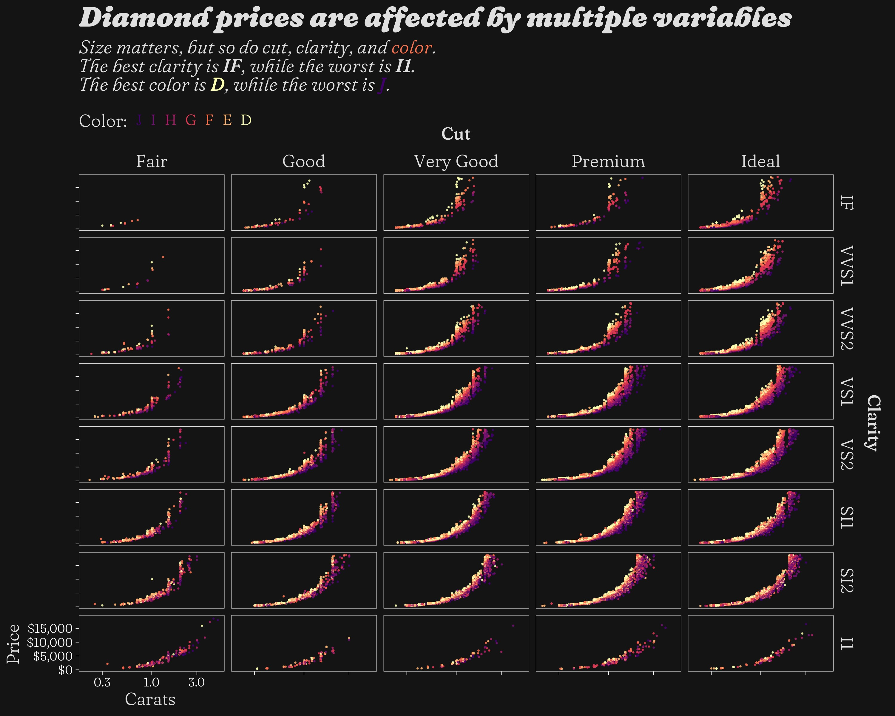
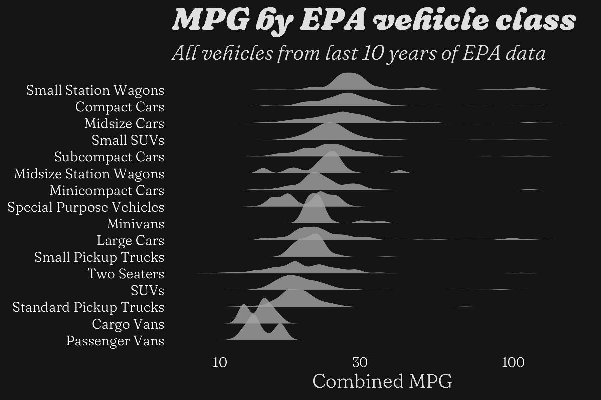
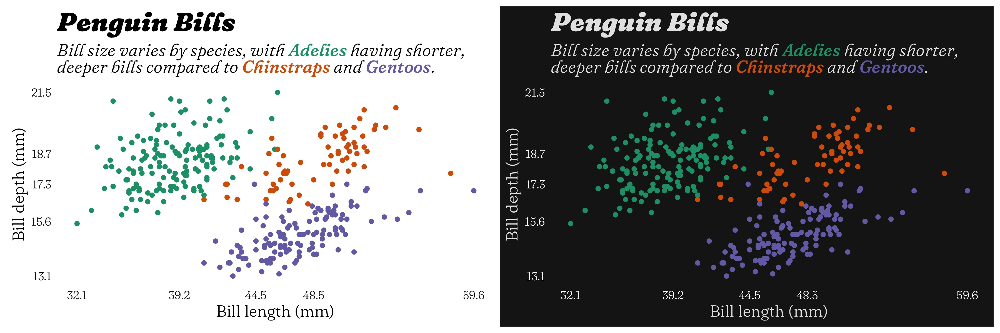

# Pretty Plots

A repo for practicing nice visualizations, including plots for #TidyTuesday.

Currently only R, but who knows...

## `images` folder

Contains sub-folders of images made from particular datasets.

## `scripts` folder

Contains scripts that correspond to a dataset and `images` sub-folder.

# Examples

## `ggplot2` diamonds data

## EPA cars data

## `palmerpenguins` data

